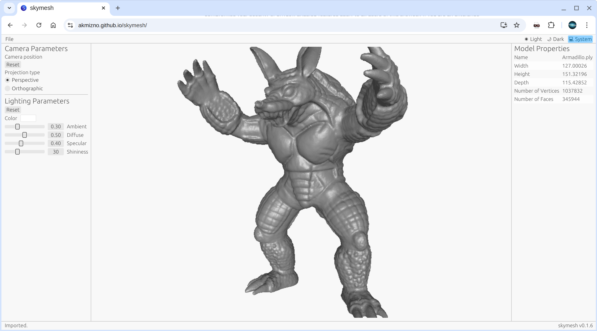

# Skymesh

Skymesh is a lightweight, cross-platform mesh viewer built with Rust and WebGPU,
supporting both native desktop and web browsers.



## Demo

[**Live Browser Demo**](https://akmizno.github.io/skymesh/)

## Browser Settings

Skymesh requires WebGPU support. Depending on your browser and OS, you may need to enable specific flags.

Tested on: **Linux (Google Chrome v145.0.7632.159)**. The following flags were required in `chrome://flags`:

| Flag                  | value   |
| --------------------- | ------- |
| #enable-vulkan        | Enabled |
| #enable-unsafe-webgpu | Enabled |
| #trees-in-viz         | Enabled |

You can test your browser's WebGPU support here:

- [WebGPU Samples](https://webgpu.github.io/webgpu-samples/)

## Usage

| Control            | Action                     |
| ------------------ | -------------------------- |
| Left Click + Drag  | Orbit camera               |
| Right Click + Drag | Pan camera                 |
| Scroll Wheel       | Zoom in/out (Dolly camera) |

## Supported Formats

| Format          | Status             | Sample files                                                    |
| --------------- | ------------------ | --------------------------------------------------------------- |
| PLY File Format | ⚠️ Partial support | [Link](https://people.math.sc.edu/Burkardt/data/ply/ply.html)   |
| STL File Format | ☑                  | [Link](https://people.math.sc.edu/Burkardt/data/stla/stla.html) |
| OFF File Format | ☑                  | [Link](https://people.math.sc.edu/Burkardt/data/off/off.html)   |

## Build

### Native (Desktop)

To run the native desktop application:

```bash
cargo run --release
```

### WebAssembly (Wasm).

To run the browser version locally, you will need [Trunk](https://trunkrs.dev/):

```bash
# Install Trunk if you haven't already.
cargo install trunk

# Serve the application.
trunk serve --release
```

Once the build is complete, open `http://localhost:8080` in your browser.
